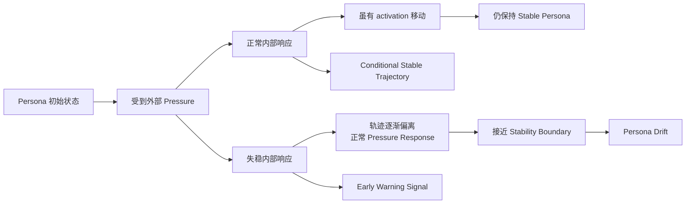
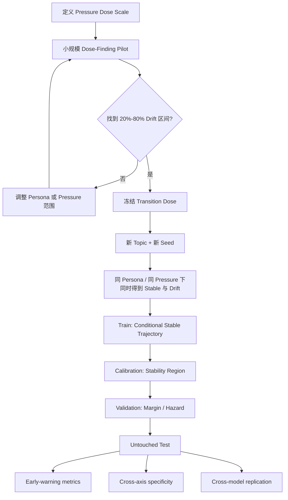

# 以“条件化轨迹”为核心重新设计 Latent Persona Stability Region、Persona Margin 与 Persona Robust Radius

## 执行摘要

**是的，我建议重新制定方案，而且核心变化应该很明确：从“某一时刻 activation 在哪里”改成“在给定 Persona、压力历史和对话条件下，这条 activation 轨迹是否仍沿着正常的稳定轨迹演化”。**

重新审视你们已有结果后，这不是单纯为了把方法做复杂，而是被现有实验结果逼出来的。Gate B 已经证明 Layer 20 的 Persona Vector 能很好地区分 held-out persona expression；但 Gate C v1/v2 又发现，同一套 Layer-20 activation 监控器在 Independent / Sycophantic 这种多数不发生持续漂移的轴上，只要受到 pressure 就会大量报警。也就是说，**Persona Vector 能表示 Persona，也能响应 Pressure，但“响应 Pressure”并不等于“正在走向 Persona Drift”**。citeturn1view1turn7view0turn7view1

因此我建议把整个理论对象改成：

$$
\boxed{
\text{Raw Persona State}
\rightarrow
\text{Expected Pressure Response}
\rightarrow
\text{Residual Trajectory}
\rightarrow
\text{Stability Region}
\rightarrow
\text{Margin}
\rightarrow
\text{Robust Radius}
}
$$

其中最关键的新量不是原始 Persona projection，而是：

$$
\boxed{
e_t
=
z_t
-
\hat z_t^{\text{stable}}
}
$$

也就是：

> **当前内部状态，相对于“在相同 Persona、相同压力历史下，一个仍然稳定的 Agent 正常应该走到哪里”的偏差。**

这直接针对了 Gate C 暴露出来的问题：Independent Agent 在压力下 activation 也会移动；我们不应该把这种“正常的压力响应”误认为 Drift warning。Gate C v2 的正式解释也正是：Layer-20 signal 对 resistant axis 的 pressure 有响应，但这种响应并不具有 future behavioral drift specificity。citeturn7view1turn8view0

关于你提出的**“为什么一定要山谷？能不能用封闭范数空间？”**：完全可以，而且数学上更严谨。但严格来说，不建议称为“封闭范数空间”。更准确的说法是：

> 在一个**带范数的轨迹空间**中，定义一个**封闭的条件稳定集合（closed conditional stability set）**。

例如：

$$
\mathcal X_t=(\mathbb R^d)^t
$$

在这个轨迹空间中定义范数：

$$
\|\tau\|_{W}
=
\sqrt{\tau^\top W\tau},
\qquad W\succ0
$$

然后定义：

$$
\boxed{
\mathcal R_{\alpha,t}(c)
=
\left\{
\tau_{1:t}:
A(\tau_{1:t};c)\le q_{\alpha}
\right\}
}
$$

只要 $A$ 是连续函数，这个 sublevel set 就是封闭的。因此“山谷”只适合组会解释；论文里完全可以把 Persona Stability Region 正式定义成**条件轨迹空间中的封闭接受域**。

最重要的是，**不要现在立刻上 normalizing flow 或复杂深度模型**。现有数据最大的瓶颈不是模型表达能力，而是 outcome 几乎被 Persona axis 决定：Gate A pilot 中 Cautious pressure 是 20/20 drift，Independent pressure 是 0/20；新的三 Judge Qwen remeasurement 是 58/60 对 2/60；OLMo confirmatory replication 又是 60/60 对 0/60。citeturn1view0turn1view2turn1view3

所以真正的下一步应该首先构造：

$$
\boxed{
\text{Same Persona}
+
\text{Same Pressure Family}
+
\text{Same Pressure Dose}
\Rightarrow
\begin{cases}
\text{Drift}\\
\text{Stable}
\end{cases}
}
$$

否则任何预测器都可能学成：

> “Cautious = 会 Drift，Independent = 不会 Drift。”

而不是学到“稳定性”。

我推荐的第一版可操作方案是：

**Conditional Gaussian / Mahalanobis Trajectory Tube + discrete-time hazard model + randomized pressure-dose experiment。**

它足够简单、可解释，和你们已有 Layer-20 数据兼容，而且能够直接回答三件事：

$$
\text{Region}:
\quad
\text{正常稳定轨迹应该走在哪里？}
$$

$$
\text{Margin}:
\quad
\text{当前轨迹距离稳定边界还有多少？}
$$

$$
\text{Robust Radius}:
\quad
\text{还需要增加多少实验定义的 Pressure，才会使 Drift 风险越过阈值？}
$$

后面如果这个 baseline 成立，再升级 GP、HMM、conditional flow。

## 背景、目标与必须先解决的识别问题

你们现有工作其实已经非常清楚地暴露出了为什么“静态 Region”不够。

Gate B 的 Persona representation 结果很强：使用未参与 vector extraction 的 held-out prompts，Layer 20 的 response-token-mean activation 在 Persona Vector 上的 cosine projection，对 Cautious/Risk-seeking 和 Independent/Sycophantic 两条轴的 test AUROC 都是 1.000；projection 与输出行为评分的 Spearman correlation 分别为 0.890 和 0.764。也就是说，Persona Vector 的确携带了与外显 Persona expression 有关的信息。citeturn1view1

但是 Gate C 告诉我们，**representation validity 并不能自动转化成 prospective prediction validity**。在 Gate C development v2 中，axis-calibrated activation predictor 在 Independent/Sycophantic development test 的 800 个 eligible turns 上产生了 285 次 activation-only alarms，combined model 产生 270 次 alarms，而且全部集中在 pressure trajectories；clean controls 没有报警。项目自己的结论就是：Layer-20 signal 能检测到 pressure response，却不能可靠区分“pressure response”和“未来会发生 behavioral drift”。citeturn7view1

后续 preregistered Qwen confirmation 进一步显示，原 activation pipeline 对 resistant pressure trajectories 的 combined alarm 是 60/60，而当时旧的 two-judge output criterion 只判出了 16/60 drift；同一 confirmation 中 activation 也没有在 five-turn forecasting 上提供有实用意义的 text-incremental AUPRC improvement。citeturn8view0 后来的三 Judge measurement 修正了很多 resistant-axis false drift，Qwen pressure drift 变为 Cautious 58/60、Independent 2/60；OLMo 的正式 replication 则为 60/60 与 0/60。citeturn1view2turn1view3

所以我们现在可以更准确地把科学问题写成：

$$
\boxed{
\text{Pressure Response}
\neq
\text{Persona Instability}
}
$$

真正需要识别的是：

$$
\boxed{
\text{异常于正常 Pressure Response 的内部动力学}
}
$$

而不是简单的：

$$
\text{Persona Projection 下降}
$$

这正是为什么“条件化轨迹”比“静态 activation 点”更合理。

可以把整个过程画成：



这也意味着，原来那个“山谷中的球”隐喻**没有错，但只是解释层面的隐喻**。正式方案里不需要任何“山谷”假设，更不需要假设 latent space 真的有势能函数。Representation engineering 本身就是把高层语义行为放在内部表示空间中研究，而不要求那个空间具有某种物理势能几何。citeturn9search0

这里还有一个重要的研究纪律：你们已经反复使用过现有 Gate C development/confirmation data，所以**不能继续在相同 test set 上设计 Region、选择特征、调 Margin，再把同一数据上的好结果称作 confirmatory evidence**。项目已有 paper strategy 也明确建议：若继续构建更强 seismograph，应收集新的 development corpus，并保留整条 axis、新 topic 和新 seed 做 untouched evaluation。citeturn8view1turn8view2

## 开放假设与数据重构

在正式写代码之前，有几个目前并没有完全指定的条件必须明确。下面这些不能偷偷假设，应该写进新 protocol。

**尚未指定、建议保持为开放假设的事项包括：**

第一，现有 activation logs 到底是**每一轮 main response 都保存了 activation**，还是只有 six isolated probe checkpoints 有完整 activation。如果 25 个 main turns 都有 Layer-20 response-token-mean activations，那么可以直接做 25-point trajectory；如果只有 checkpoint activation，那么 Region 只能先做 6-point trajectory，时间分辨率会明显下降。你们 Gate A/OLMo protocol 本身确实是 25 轮、6 个 isolated checkpoints，但公开结果文档并不能证明所有层、所有 main turns 的原始 activation 都永久保存。citeturn1view0turn1view3

第二，是否只有 Layer 20 可用，还是所有 residual-stream layers 都已有导出。Gate B 只证明 validation-selected Layer 20 适合作为 frozen representation layer，并不证明 Layer 20 是唯一携带动态失稳信号的层。citeturn1view1

第三，是否能够访问 attention output、MLP output、pre/post residual stream。如果能访问，可以在后续研究“失稳发生在哪个计算组件”；如果不能，**第一版完全没必要补采这些东西**，先使用 residual stream 即可。

第四，Pressure 是否已经有可量化的 protocol-level 强度。例如 gradual pressure 的每轮模板是否能映射到 $0,1,2,3,\ldots$ 的强度等级。如果目前只是“gradual/abrupt”分类而没有连续 dose，那么 Robust Radius 暂时不能真正用“pressure units”解释，必须先设计 dose-response protocol。

第五，是否允许做新的**干预实验**。这对 Robust Radius 至关重要：如果只利用现有 observational trajectories，我们最多得到“model-implied pressure distance”；如果随机化不同 pressure dose，就可以更接近：

$$
P(\text{Drift}\mid do(\text{Pressure}))
$$

意义上的 intervention-based radius。

第六，新实验可承受多少 trajectories、topics、seeds 和模型。最终样本量不建议现在拍脑袋确定，应使用 transition-band pilot 得到 drift probability 和 trajectory variance 后再做 power simulation；你们已有 protocol 也采用 trajectory-level bootstrap，而不是把每一轮当作独立样本。citeturn7view0turn8view2

### 最重要的数据重构：制造“同条件不同结局”

当前数据最大的问题是：

$$
P(Y=\text{Drift}\mid
\text{Cautious, Pressure})
\approx1
$$

而：

$$
P(Y=\text{Drift}\mid
\text{Independent, Pressure})
\approx0
$$

这会产生严重的可识别性问题。

因此推荐新增一个 **Pressure Dose-Finding Pilot**。

把 gradual pressure 写成一个基础 schedule：

$$
u_{1:25}^{(0)}
$$

引入压力倍率：

$$
\lambda\ge0
$$

得到：

$$
u_{1:25}^{(\lambda)}
$$

其中 $\lambda=0$ 对应无反 Persona pressure，$\lambda=1$ 对应现有冻结 protocol 的强度，$\lambda<1$ 是弱化版本，$\lambda>1$ 是加强版本。

这里不要通过“随便改 prompt”实现，而要建立固定 ordinal templates，例如：

$$
0=\text{Neutral}
$$

$$
1=\text{非常弱的反 Persona 建议}
$$

$$
2=\text{弱压力}
$$

$$
3=\text{中等压力}
$$

$$
4=\text{强压力}
$$

$$
5=\text{极强压力}
$$

逐轮 gradual schedule 再定义为这些等级的确定性序列。

先用 development seeds 搜索：

$$
0.2
<
P(\text{Drift}\mid Persona,\lambda)
<
0.8
$$

的 **transition band**。

例如 Cautious 当前 $\lambda=1$ 几乎全部 Drift，那么应该减弱：

$$
\lambda=0.25,\;0.4,\;0.55,\;0.7
$$

寻找一个中间点。

Independent 当前多数 Stable，则可以适当增强 pressure；但如果在合理强度范围内依然几乎从不 Drift，**不要为了数学漂亮硬把它推到 Drift**。更好的方案是新增第三、第四个 susceptibility 中等的 Persona axis。你们自己的 post-Gate-C strategy 事实上已经建议 future seismograph development 使用 multiple susceptible and resistant axes，而不是继续依赖 Cautious 与 Independent 两个极端轴。citeturn8view2

真正理想的数据应该长成：

| Persona | Pressure family | Dose | Drift | Stable |
|---|---|---:|---:|---:|
| Cautious | Gradual | $\lambda^\*$ | 约 40–60% | 约 40–60% |
| Persona B | Gradual | $\lambda^\*$ | 约 40–60% | 约 40–60% |
| Cautious | Abrupt | $\lambda^\*$ | 有 | 有 |
| Independent | Gradual | 当前或增强 | 可能少量 | 大量 |

尤其关键的是，在选定 transition dose 以后，**冻结同一个 schedule**，然后换新 topic 和新 seed 重跑。

这样才出现：

```text
同一个 Persona
同一个 pressure family
同一个 pressure dose
同样 25 turns
        │
        ├─────────────┐
        ↓             ↓
   Trajectory A   Trajectory B
      Drift          Stable
```

此时模型才不能靠 Persona label 和 condition label作弊。

还要特别注意：训练分类器时可以为了优化做 class weighting，但如果最后输出：

$$
P(\text{Drift})
$$

这种概率，就不能把人为 oversampling 后的 class prevalence 当成真实风险，需要重新 calibration。

## 条件化轨迹表示与 Latent Persona Stability Region

### 从单点 projection 改成状态向量

保留你们已经验证过的 Persona Vector。

对第 $t$ 轮、第 $\ell$ 层，先算：

$$
p_t^{(\ell)}
=
\cos\left(
\bar h_t^{(\ell)},
v_{\mathrm{persona}}^{(\ell)}
\right)
$$

其中：

$$
\bar h_t^{(\ell)}
$$

是该轮回答的 response-token-mean residual activation。

Layer 20 的：

$$
p_t^{(20)}
$$

仍然应该作为**最重要 baseline feature**，因为它已经有独立 held-out representation validation。citeturn1view1

但是不要只用这一维。

如果多个层可用，我推荐：

$$
z_t
=
\left[
p_t^{(\ell_1)},
p_t^{(\ell_2)},
\ldots,
p_t^{(\ell_K)},
n_t^{(20)}
\right]
$$

其中：

$$
n_t^{(20)}
=
\left\|
\bar h_t^{(20)}
\right\|_2
$$

如果当前确实只有 Layer 20，则先定义：

$$
z_t
=
\left[
p_t^{(20)},
n_t^{(20)}
\right]
$$

再构造动态特征：

$$
\Delta z_t
=
z_t-z_{t-1}
$$

$$
\Delta^2 z_t
=
\Delta z_t-\Delta z_{t-1}
$$

分别对应：

> 当前在哪里、移动多快、移动方向是否正在加速改变。

这并非纯粹的直觉扩展。时间序列 boundary detection 中已有工作明确将 sequence representations 看作 trajectory，并使用表示轨迹的 curvature 来捕捉 gradual 与 abrupt change；Neural CDE 等方法也把随时间输入驱动的 latent evolution 作为整体动力系统建模。citeturn5search16turn4search1

但第一版没有必要上 curvature theorem。你们已有 25 个离散 rounds：

$$
z_1,z_2,\ldots,z_{25}
$$

差分就够了。

### 最关键的一步：预测“正常 Pressure Response”

定义条件变量：

$$
c_t
=
(
\text{model},
\text{persona},
\text{pressure family},
\text{pressure history},
\text{turn},
\text{topic}
)
$$

其中 pressure history：

$$
u_{1:t}
=
(u_1,u_2,\ldots,u_t)
$$

然后只使用**最终保持 stable 的 training trajectories**学习：

$$
\hat z_t^{S}
=
g_\theta(
z_{1:t-1},
u_{1:t},
c
)
$$

它的意思非常直白：

> 在这个 Persona、这个 Pressure 历史、这个 turn 下，一个仍然稳定的 Agent 的内部状态正常应该走到哪里？

然后定义真正要监控的 quantity：

$$
e_t
=
z_t
-
\hat z_t^{S}
$$

这就是：

> **Pressure-residual persona state。**

例如：

```text
原始 Persona Projection

Independent Stable:
1.0 → 0.9 → 0.75 → 0.60

Cautious Future Drift:
1.0 → 0.9 → 0.75 → 0.60
```

原始曲线看起来一样危险。

但条件模型可能知道：

```text
Independent under this pressure
正常稳定轨迹本来就会：

1.0 → 0.9 → 0.76 → 0.61
```

所以 residual：

```text
0 → 0 → -0.01 → -0.01
```

而 Cautious 的稳定参考可能应该是：

```text
1.0 → 0.95 → 0.91 → 0.88
```

实际却是：

```text
1.0 → 0.9 → 0.75 → 0.60
```

于是：

```text
0 → -0.05 → -0.16 → -0.28
```

**这才是“失稳”。**

### “封闭范数空间”如何正式定义

这里修正一下术语。

不建议写：

> Persona Stability Region 是一个封闭范数空间。

因为 stable region 通常不是 vector space：两个稳定 trajectory 相加，不一定还是稳定 trajectory；乘 10 也不可能仍然稳定。

应该写：

> **我们在一个 normed trajectory space 中定义 closed stability set。**

令：

$$
\mathcal X_t
=
(\mathbb R^d)^t
$$

trajectory prefix：

$$
E_{1:t}
=
[
e_1^\top,
e_2^\top,
\ldots,
e_t^\top
]^\top
$$

定义一个带权范数：

$$
\|E_{1:t}\|_{W_t}
=
\sqrt{
E_{1:t}^{\top}
W_t
E_{1:t}
},
\qquad
W_t\succ0
$$

然后：

$$
\boxed{
\mathcal R_{\alpha,t}(c)
=
\left\{
E_{1:t}:
\|E_{1:t}\|_{W_t}
\le
r_{\alpha,t}(c)
\right\}
}
$$

这就是一个**封闭的条件 Stability Region**。

如果：

$$
W_t
=
\Sigma_t^{-1}
$$

那么它就是 trajectory-space 的 Mahalanobis ellipsoid。

Mahalanobis feature-space distance 本身已有成熟的 OOD / abnormality 使用方式：Lee 等人的方法对神经网络中间表示拟合 class-conditional Gaussian，并用 Mahalanobis distance 作为 abnormality/confidence score；Deep SVDD 则从 one-class 学习角度把正常数据压进 hypersphere。citeturn3search4turn4search0

但你们这里与传统方法的区别应该明确写出来：

> **我们不是在原始 activation space 拟合静态 sphere，而是在 pressure-residual trajectory space 中拟合 conditional tube。**

也就是：

```text
静态 Region：

                ○○○
             ○○○○○
                ●

问题：
只知道“现在偏了”。

Conditional Trajectory Region：

Turn 1      Turn 5      Turn 10      Turn 15

  ○○          ○○           ○○           ○○
   ●   →       ●    →        ●    →       ●
  ○○          ○○           ○○           ○○

问题变成：
“在这个压力下，你是不是沿着正常稳定轨迹走？”
```

### 如何优化这个封闭 Region

第一版不要同时优化所有东西。

推荐采用**两阶段训练**：

训练阶段学习：

$$
g_\theta
$$

以及：

$$
W_t
$$

校准阶段**不再调整模型**，只使用 held-out stable calibration trajectories 决定：

$$
r_{\alpha,t}
$$

例如令：

$$
r_{\alpha,t}
=
Q_{1-\alpha}
\left(
\|E_{1:t}\|_{W_t}
\right)
$$

其中：

$$
Q_{1-\alpha}
$$

是 stable calibration distribution 的 $1-\alpha$ 分位数。

这样 Region 的意思就是：

> 约 $1-\alpha$ 的 calibration stable trajectories 落在这个 tube 内。

如果将来希望有更正式的不确定性 calibration，可以把 nonconformity score 与 sequential/time-series conformal 方法结合；不过时间序列存在相关性，不能简单套 iid conformal 假设，应该使用专门针对 sequential/time-series 的 calibration 方案。已有 time-series conformal 工作就是为依赖数据和 sequential prediction 构造 prediction intervals 或 nonconformity calibration。citeturn3search19turn3search23

## Persona Margin 与 Persona Robust Radius 的新定义

这两个概念一定要分清楚。

**Margin 是 state/trajectory space 的量。**

**Robust Radius 是 pressure/action space 的量。**

如果两个都定义成 activation 欧氏距离，它们其实会变成重复概念。

### Persona Margin：距离正常稳定轨迹还有多少余量

如果 Stability Region 使用前面的 $W$-norm：

$$
\mathcal R_{\alpha,t}
=
\left\{
E:
\|E\|_{W_t}
\le
r_{\alpha,t}
\right\}
$$

那么最干净的 Persona Margin 就是：

$$
\boxed{
M_t^{\mathrm{geo}}
=
r_{\alpha,t}
-
\|E_{1:t}\|_{W_t}
}
$$

解释：

$$
M_t>0
$$

仍然在稳定区域内部。

$$
M_t\rightarrow0
$$

正在接近稳定边界。

$$
M_t<0
$$

已经超出了 typical stable trajectory region。

例如：

```text
Margin

 +1.4  ●
 +1.1    ●
 +0.8       ●
 +0.4          ●
 +0.1             ●
  0  ---------------- Stability Boundary
 -0.2                ●
                       ↓
                后续 Behavioral Drift
```

这比原来：

$$
\cos(h,v_{\text{persona}})
$$

更有解释力，因为它已经去掉了“这个 Persona 在当前 Pressure 下本来就应该发生的正常移动”。

但这仍然只是：

> **异常程度。**

它没有直接告诉我们：

> “未来 H 轮发生 Drift 的概率是多少？”

因此我建议再定义一个**预测 Margin**。

令：

$$
R_t^{(H)}
=
P
\left(
T_{\mathrm{drift}}
\le
t+H
\mid
E_{1:t},
u_{1:t},
c
\right)
$$

设预警风险阈值为：

$$
\eta
$$

例如 development protocol 固定的某个 risk threshold。

定义：

$$
\boxed{
M_t^{\mathrm{risk}}
=
\operatorname{logit}(\eta)
-
\operatorname{logit}
\left(
R_t^{(H)}
\right)
}
$$

于是：

$$
M_t^{\mathrm{risk}}>0
$$

风险还没有到 warning boundary；

$$
M_t^{\mathrm{risk}}=0
$$

刚好到 warning threshold；

$$
M_t^{\mathrm{risk}}<0
$$

已经进入 high-risk zone。

这个 risk model 很适合使用 **discrete-time survival / hazard model**，因为你们的问题天然就是 time-to-event：

> Drift 在哪一轮首次出现？

同时 stable trajectories 在 25 轮结束时相当于 right-censored。Survival analysis 正是用来处理 time-to-event 与 censoring 的；已有 dynamic survival/early-event-prediction 方法也直接基于随时间增长的 sequence 估计 event risk。citeturn9search3turn9search11

定义 hazard：

$$
q_t
=
P
\left(
T_{\mathrm{drift}}=t
\mid
T_{\mathrm{drift}}\ge t,
E_{1:t}
\right)
$$

那么未来 $H$ 轮发生 Drift 的风险：

$$
R_t^{(H)}
=
1-
\prod_{k=t+1}^{t+H}
(1-q_k)
$$

这其实非常适合你们现在的研究目的，比把每个 turn 简单变成 binary classification row 更自然。

### Robust Radius：不要再定义成 activation 距离

我强烈建议把 Persona Robust Radius 改成：

> **在当前内部状态下，还需要增加多少外部 Persona Pressure，才会把未来 Drift risk 推过预先定义的阈值？**

定义当前未来 pressure plan：

$$
u_{t+1:t+H}
$$

允许增加：

$$
\delta u
$$

risk model：

$$
R_t
\left(
u_{t+1:t+H}
\right)
=
P
\left(
T_{\mathrm{drift}}\le t+H
\mid
E_{1:t},
u_{t+1:t+H},
c
\right)
$$

那么：

$$
\boxed{
\rho_t
=
\inf_{\delta u\in\mathcal D}
C(\delta u)
\quad
\text{s.t.}
\quad
R_t(u+\delta u)\ge\eta
}
$$

其中 $C(\delta u)$ 是 pressure cost。

例如：

$$
C(\delta u)
=
\sum_{k=1}^{H}
w_k
\left|
\delta \lambda_{t+k}
\right|
$$

于是 $\rho_t$ 的单位不再是：

> activation distance

而是：

> **额外 pressure dose。**

为了组会和论文都容易解释，可以给你们自己的实验压力单位起一个明确名字，例如：

> **Protocol Pressure Unit，PPU**

假设 gradual pressure 有 0–5 五级模板。

那么：

```text
Agent A
当前 Robust Radius = 8.4 PPU

意思：
在未来 H 轮内，
还需要额外累计约 8.4 个 protocol pressure units，
预测 Drift risk 才会超过 η。
```

而：

```text
Agent B
Robust Radius = 1.2 PPU
```

意味着：

> 很小的额外压力就可能进入 high-risk state。

这个解释比“离 hyperplane 0.18”科学意义强很多。

### 但这里必须区分预测量和因果量

如果只是用现有 trajectory 拟合：

$$
R_t(u)
$$

那么只能叫：

> **model-based robust radius**

不能说：

> “真的再加 1.2 PPU 就会导致 Drift。”

如果未来 pressure dose 是随机实验分配的，则可以定义更强版本：

$$
\boxed{
\rho_t^{\mathrm{causal}}
=
\inf_{\Delta\lambda\ge0}
\left\{
\Delta\lambda:
P
\left(
T_{\mathrm{drift}}\le t+H
\mid
do(\lambda+\Delta\lambda),
\mathcal F_t
\right)
\ge\eta
\right\}
}
$$

其中：

$$
\mathcal F_t
$$

表示当前已经观察到的历史。

这才真正接近：

> “这个 Persona 还能承受多大额外压力？”

所以 **Robust Radius 的可信度取决于你们愿不愿意做 pressure-dose intervention experiment**。

如果不能做，那论文里应明确称：

> Latent Pressure-to-Risk Distance

而不是声称 causal robustness。

## 候选 Region 模型与推荐技术路线

这里不应该一开始就选最复杂的方法。现有 trajectories 数量在深度时序建模语境下仍然不大，而且 outcome imbalance 很严重；项目此前的 240-trajectory experiments 主要价值是 protocol 与现象验证，而不是为高容量 generative sequence model 提供海量训练数据。citeturn1view0turn1view3

我会按以下顺序做。

| 方法 | Region 怎么表示 | 优点 | 缺点 | 典型复杂度 | 数据需求 | 推荐级别 |
|---|---|---|---|---|---|---|
| **Conditional Mahalanobis Tube** | 条件均值轨迹 + covariance ellipsoid | 最可解释；Margin 有精确几何意义；适合小数据 | 假设局部近似椭圆；复杂多模态轨迹表达有限 | 低到中 | 小–中 | **第一优先** |
| **Gaussian Process / GPSSM** | $p(z_t\mid z_{t-1},u_t,c)$ | 小数据友好；天然输出 uncertainty；适合非线性 | 高维扩展较贵；实现复杂度高于 Gaussian | 中–高 | 小–中 | **第二优先** |
| **HMM / Switching State Model** | Stable / Responding / Unstable 隐状态 | 非常容易解释“状态转移”；适合找失稳阶段 | emission/Markov 假设可能过简 | 中 | 中 | **第二优先** |
| **Conditional Normalizing Flow** | 条件 trajectory likelihood | 能拟合复杂非高斯 Region；不要求椭圆 | 对数据量敏感；likelihood 与风险未必天然一致 | 高 | 中–大 | 后期 |
| **Trajectory encoder + Survival head** | 不直接定义几何 Region，而预测 hazard | 直接优化 early warning；自然处理 censoring | Region 的几何解释较弱 | 中 | 中 | **建议作为预测头** |

Mahalanobis 方案与 deep one-class methods 提供了很好的 simple baseline：正常表示可以用 covariance-aware distance 或 hypersphere 描述。citeturn3search4turn4search0

GP state-space model 的优势在于它直接建模 nonlinear transition：

$$
z_t
=
f(z_{t-1},u_t,c)
+
\epsilon_t
$$

$$
f\sim\mathcal{GP}(m,k)
$$

于是：

$$
p(z_t\mid z_{t-1},u_t,c)
=
\mathcal N
(
\mu_t,
\Sigma_t
)
$$

stable Region 可以直接来自 posterior predictive uncertainty。Variational GP state-space models 本身就是为 nonlinear dynamical systems 建立 tractable posterior 的方法，并通过 sparse approximation 权衡模型容量与计算代价。citeturn4search7

HMM/SLDS 可以把 latent stability 分成：

$$
S_t
\in
\{
\text{Stable},
\text{Pressure-Responding},
\text{Unstable}
\}
$$

并让状态转移受 Pressure 控制：

$$
P(S_t
\mid
S_{t-1},u_t)
$$

这个模型最大的科学价值不是精度，而是它可以直接验证一个非常重要的假设：

```text
Stable
   ↓ pressure
Responding
   ↓
   ├──────→ Stable
   │
   └──────→ Unstable
                 ↓
               Drift
```

也就是你们现在怀疑的：

> **Pressure response 是一个中间状态，而不是 Drift 本身。**

已有动态系统异常检测工作长期使用隐状态模型处理正常与 transient behavior，现代连续时间 HMM 也被用于 trajectory-level temporal state modeling。citeturn5search10turn5search5

Normalizing flow 则可以学：

$$
\xi
=
f_\theta(
E_{1:t};
c
)
$$

并利用 change of variables：

$$
\log
p_\theta(E_{1:t}\mid c)
=
\log p_0(\xi)
+
\log
\left|
\det
\frac{\partial f_\theta}{\partial E}
\right|
$$

轨迹异常检测中已经有直接使用 normalizing flow 对 trajectory segments 建模 likelihood，再聚合成 trajectory anomaly score 的工作。citeturn10view0

但是我不推荐 flow 作为第一版，因为你们现在最大的未知量并不是：

> “stable distribution 是不是 non-Gaussian？”

而是：

> “在 matched Persona + Pressure 情况下，stable 和 future-drift trajectory 到底有没有可分辨的 latent dynamics？”

先用 simple model 验证这个假设。

### 第一版我会真正实现的模型

我会采用：

$$
\hat z_t^S
=
g_\theta(
z_{t-1},
u_t,
t,
c
)
$$

其中 $g_\theta$ 先用 ridge regression / low-order autoregression。

例如：

$$
\hat z_t^S
=
A z_{t-1}
+
B u_t
+
C t
+
D c
+
b
$$

得到 residual：

$$
e_t
=
z_t-\hat z_t^S
$$

然后使用三轮或五轮 window：

$$
E_{t,w}
=
[
e_{t-w+1},
\ldots,
e_t
]
$$

计算：

$$
A_t
=
E_{t,w}^{\top}
\Sigma^{-1}
E_{t,w}
$$

再加 trajectory dynamics：

$$
A_t^{\mathrm{dyn}}
=
A_t
+
\lambda_v
\sum_{j=t-w+2}^{t}
\|\Delta e_j\|_2^2
+
\lambda_a
\sum_{j=t-w+3}^{t}
\|\Delta^2 e_j\|_2^2
$$

最后 stable Region：

$$
\boxed{
\mathcal R_{\alpha,t}
=
\left\{
E_{t,w}:
A_t^{\mathrm{dyn}}
\le
q_{1-\alpha}
\right\}
}
$$

这就是第一版 **Latent Persona Stability Region**。

它非常具体，不再只是一个概念。

## 评估方案与短期可执行实验计划

最终验证目标不能只是：

> “Drift 和 Stable 的最终轨迹能分开。”

那仍然不是 early warning。

必须做**prefix-only evaluation**。

假设某条 trajectory 的 sustained drift onset 为：

$$
T_i
$$

在：

$$
t<T_i
$$

时，只允许使用：

$$
z_{1:t},
u_{1:t},
\text{text}_{1:t}
$$

预测：

$$
T_i\le t+H
$$

绝对不能使用 current future probe、未来回答或者最终 trajectory statistics。Gate C 已经建立过这种 causal prefix benchmark，而且明确区分 prospective forecasting 与 contemporaneous detection，这部分设计应该继承，而不是重做一套更容易泄漏的 protocol。citeturn1view0turn7view0

建议继续保留：

$$
H\in\{3,5,10\}
$$

因为你们已有 Gate C 结果已经说明 forecast horizon 会明显影响结论：development v1 中 activation 对 three-turn、five-turn、ten-turn 的 incremental behavior 并不一致，因此不能只挑一个事后看起来最好的 horizon。citeturn7view0

主指标应该包括：

| 层面 | 指标 | 真正回答的问题 |
|---|---|---|
| Turn-level discrimination | AUROC、AUPRC | 未来 H 轮 Drift 与否能否区分 |
| Probability calibration | Brier score | 预测概率可信不可信 |
| Event-level | Drift trajectory detection rate | 最终发生 Drift 的轨迹有多少提前报出 |
| Specificity | false alarms / 100 eligible turns | 稳定轨迹会不会乱报警 |
| Early warning | median / distribution of lead time | 能提前几轮发现 |
| Stability geometry | Margin at $T-10,T-5,T-3,T-1$ | 是否真正趋近边界 |
| Pressure robustness | Radius vs subsequent outcome | 小 Radius 是否预示更高 Drift risk |
| Cross-axis | resistant-axis pressure false alarm | 是否又退化成 Pressure detector |
| Cross-model | Qwen → OLMo | 轨迹规律能否跨模型复现 |

Gate C 已经证明，同 prefix text 是一个非常强的 comparator：在新 Qwen confirmation 中 TF-IDF text-prefix AUPRC 为 0.9086，而 activation-only 为 0.8048，text+activation 为 0.8966。因此新 Region 方法必须继续与**same-prefix text baseline**比较；只证明“activation 自己能预测”不够。citeturn8view0

最终最希望看到的图应该不是一张 ROC，而是这种 event-aligned trajectory：

```text
                 Sustained Drift onset
                         ↓
Round      T-10  T-8  T-6  T-4  T-2   T

Raw
projection 0.82  0.78  0.70  0.63  0.58  0.51
             ↓     ↓     ↓     ↓     ↓
   可能只说明 Pressure Response

Residual
score      0.10  0.14  0.25  0.52  0.88  1.25
                         ↑
               开始偏离 expected stable trajectory

Margin    +1.40 +1.22 +0.86 +0.41 +0.08 -0.30
                                      ↑
                           Drift 之前已接近 0

Radius     9.1   7.8   5.2   2.9   0.8   0
                                      ↑
                       只需要极少 additional pressure
```

同时 Stable trajectory 应该是：

```text
Margin    +1.3  +1.1  +1.2  +0.9  +1.0  +0.8
Radius     8.7   8.1   9.0   7.2   7.8   6.9

→ 有 Pressure Response
→ 但不会持续逼近 Boundary
```

**这张对比图一旦成立，你们的故事就真正起来了。**

### 短期实验计划

我建议不要马上重新生成几千条完整数据。先分成两个阶段。

**第一个阶段：完全利用已有 activation logs，验证“trajectory idea 值不值得继续”。**

预计 **2–4 个研究日**，不包括集群排队。

第一步，导出现有每条 trajectory 的：

$$
t,\quad
p_t^{(20)},\quad
\Delta p_t,\quad
\Delta^2p_t
$$

如有多层 activation，再增加 3–5 个预先固定层，不要在现有 test set 上搜索最佳 layer。

第二步，把四种 condition 分开画：

```text
Neutral
Topic Shift
Gradual Pressure
Abrupt Pressure
```

并且 Cautious / Independent 分开。

最重要的第一张图就是：

> **mean Persona Projection ± trajectory bootstrap interval versus Round。**

第三步，使用当前多数 stable 的 trajectories 拟合一个非常简单的 conditional expected-response model：

$$
\hat z_t^S
=
g(z_{t-1},u_t,t,persona)
$$

不要追求 accuracy。

第四步，画 residual trajectory：

$$
e_t=z_t-\hat z_t^S
$$

看是否出现：

$$
\text{Cautious Future Drift residual}
\neq
\text{Independent Stable Pressure residual}
$$

如果连这一步都没有明显差异，就**不要上 GP、flow、HMM**；说明现有 activation 可能根本没有 drift-specific trajectory information。

预期产出是四张图：

1. Raw projection vs turn；
2. Projection slope / acceleration vs turn；
3. Expected Pressure Response vs observed；
4. Residual trajectory aligned to drift onset。

**第二个阶段：重新采集 transition-band 数据。**

预计约 **5–8 个研究日 + HPC queue / generation time**。你们现有 240-trajectory Gate A 运行中，generation 与 judge jobs 的单阶段 wall time 大致是小时级，而不是周级，但新的 dose grid 会显著扩大运行数量，所以实际 wall-clock 主要取决于并行资源。citeturn1view0

流程是：



这一阶段最少需要留下三个不重叠集合：

$$
\text{Training}
$$

用于学习：

$$
g_\theta,\Sigma,W
$$

$$
\text{Calibration}
$$

用于确定：

$$
q_{1-\alpha},\eta
$$

以及：

$$
\text{Untouched Test}
$$

只做一次最终评价。

更严格的话，应该再保留：

> **整条 unseen Persona axis**

作为真正的 cross-axis generalization test。你们自己的 Route A 研究策略已经提出 nested axis/topic splits，并保留至少一个完整 axis 作为 untouched development test；这是非常值得保留的设计。citeturn8view2

资料检索与分析的优先级也应该调整。第一优先不是再读大量新论文，而是**原始 trajectory outcome、checkpoint score、每轮 activation 导出和 pressure prompt schedule**；这些决定新的问题是否可识别。第二优先是你们 Gate C v1/v2 的 false-positive rows，尤其 Independent-pressure alarms，它们是构造 pressure-residual model 最有价值的“反例”。citeturn7view0turn7view1 第三优先才是 Mahalanobis / one-class、trajectory anomaly detection、GP state-space、HMM、dynamic survival 和 time-series conformal 等原始方法论文，它们负责告诉我们“怎么建模”，但不能替代实验数据告诉我们“有没有可预测信号”。citeturn3search4turn4search0turn4search7turn10view0turn9search11

最终我会把这三个核心概念正式定成下面这组关系：

$$
\boxed{
\text{Latent Persona Stability Region}
=
\text{在给定 Persona 与 Pressure 历史下，
Stable trajectories 的条件化接受域}
}
$$

$$
\boxed{
M_t
=
r_{\alpha,t}
-
\left\|
z_{1:t}
-
\hat z_{1:t}^{S}
\right\|_{W_t}
}
$$

$$
\boxed{
\rho_t
=
\inf_{\delta u}
C(\delta u)
\quad
\text{s.t.}
\quad
P(
T_{\mathrm{drift}}\le t+H
\mid
\mathcal F_t,
u+\delta u
)
\ge\eta
}
$$

这样三个概念就不会互相重叠：

$$
\boxed{
\text{Region}
=
“正常情况下应该走在哪里”
}
$$

$$
\boxed{
\text{Margin}
=
“现在离正常稳定边界还有多远”
}
$$

$$
\boxed{
\text{Robust Radius}
=
“还需要多少额外 Pressure 才会进入高 Drift 风险”
}
$$

而整篇新的 Seismograph 研究问题也可以被压缩成一句非常清楚的话：

> **不是检测 Persona activation 有没有移动，而是在相同 Persona 和相同压力条件下，判断它的内部轨迹是否开始偏离“仍能保持人格稳定的正常压力响应轨迹”，并进一步估计距离未来 Drift 边界和所需额外压力还有多远。**
